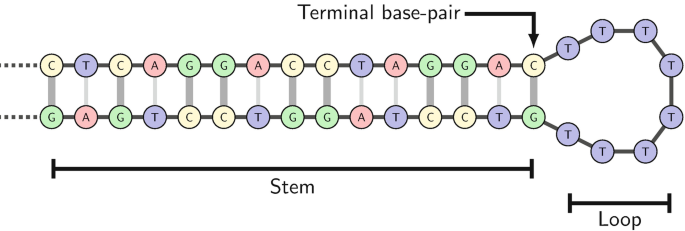

# DNA Thermodynamic Prediction Experiments

## Overview and Goal
The goal of this project is to predict the thermodynamic properties of short DNA hairpins and duplexes, specifically **enthalpy ($\Delta$H)**, **melting temperature (Tm)**, and the derived **Free Energy ($\Delta$G at 37°C)**. 

To explore which model architectures best capture DNA folding mechanics, we tested three distinct neural network approaches. Each method utilizes a completely different way of **encoding** the structural and positional data of the DNA molecules.

## 1. Before moving forward, lets understand what is the Dataset we are working with. 
The dataset consists of tables having something like-
|RefSeq|TargetStruct|sodium|DNA_conc|dH|Tm|dG_37|
|------|------------|------|---------|---|--|-----|
|TATAGCCTATA|(((...)))|1.0|50.0|-35.5|70.0|-7.5|

From the above table, our:
- **Target Variables** are: dH, Tm, and dG_37
- **Input Variables** are: RefSeq, TargetStruct
  - RefSeq is the DNA sequence, which is a string of characters (A, T, C, G) representing the nucleotides.
  - TargetStruct is the secondary structure of the DNA, represented in dot-bracket notation.

`Thus, in essence our Input lies in a much higher dimensional space as it is not just a sequence but also having a structural components.`

Additionally the dataset has different classes of sequences that have different structural properties-
- **arr**: These are hairpin sequences with a loop and a stem. The structure is represented in dot-bracket notation, where `(` and `)` indicate paired bases in the stem, and `.` indicates unpaired bases in the loop. For example, `(((...)))` represents a hairpin with a 3-base pair stem and a 3-base loop.

To get an intuitive understanding, the below image shows most but not all of the possible structural motifs in the dataset 'arr' class.

 - *Source: https://link.springer.com/chapter/10.1007/978-3-030-85825-4_3*

- **duplex**: These are sequences that form a double-stranded structure. The dot-bracket notation for duplexes typically shows two strands paired together, such as `((...))+((...))`, where each set of parentheses represents one strand of the duplex. 
If you refer the above image then a duplex would look exactly the same just without the loop at the end. Thus duplex has two strands.

## Current State of the project
- Can Implement the GNN method presented in the original paper.
- Can implement a new model with new encoding of dataset, which is 1D CNN.
    - This performs better(than the original) for the 'arr' datapoints in the dataset. 
    - However, it performs worse for the 'duplex' datapoints in the dataset.
    - It has a rigid encoding scheme, which is not flexible to accomodate other types of DNA structures (e.g., duplexes, mismatches, etc.)

- Can implement a new model with new encoding of dataset, which is 2D CNN.
    - This performs better than both the original GNN and the 1D CNN for the 'arr' datapoints in the dataset.
    - Tough this is flexible to accomodate other types of sequences, it still performs worse for the 'duplex' datapoints in the dataset.

## 2. Experimentals
#### 1. Graph Neural Network (GNN) – *Paper Reference Model*
- **The Concept**: DNA folding is naturally represented as a molecular graph.
- **The Encoding**: 
  - **Nodes**: Each individual nucleotide (A, T, C, G) is treated as a node using a one-hot encoded vector.
  - **Edges**: We define a set of graph edges for physical connections:
    1. Sequential backbone connections (the $5' \to 3'$ and $3' \to 5'$ links between adjacent bases).
    2. Structural connections representing Hydrogen Bonds across the folded loop (derived from dot-bracket notations, e.g., `(((...)))`).
- **Why it makes sense**: The graph naturally bridges distant elements in the sequence that interact in 3D physical space, allowing graph convolutions to pass information directly between bonded nucleotide pairs.

 #### 2. 1D Convolutional Neural Network (1D CNN)
- **The Concept**: Treating DNA like sequential text data, but incorporating structural hints in parallel channels.
- **The Encoding**: The input is treated as a 1D sequence of length $N$. For every position in the sequence, we provide a 7-channel vector:
  - 4 channels for the nucleotide identity (A, T, C, G one-hot encoded).
  - 3 channels indicating structural role (base mapped as `(`, `)`, or `.` to indicate pairing direction or unbound loop state).

#### 3. 2D Convolutional Neural Network (2D CNN)
- **The Concept**: Explicitly flattening the DNA hairpin into a 2D "ladder" image to simulate its folded spatial arrangement.
- **The Encoding**: The hairpin sequence is "computationally folded" at the midpoint of its loop into a grid with 3 spatial rows:
  - **Top Row**: The $5'$ arm of the stem up to the left half of the unbound loop.
  - **Middle Row**: Indicator flags showing whether a hydrogen bond exists between the top and bottom.
  - **Bottom Row**: The $3'$ arm of the sequence and the right half of the unbound loop, reversed to align exactly beneath its interacting partner.
  - Each "pixel" in this matrix holds the one-hot encoded nucleotide or interaction features. 
- **Why it makes sense**: This approach mimics the physical base-pairing alignment. Unlike a 1D CNN where bonded pairs are far apart at opposite ends of the sequence array, the 2D ladder aligns them vertically adjacent. Standard 2D image convolutions can then naturally "view" the paired nucleotides together in a single filter pass.

---

## 3. Results Achieved

Models were evaluated on their prediction accuracy against unseen validation sets using **Mean Absolute Error (MAE)**. Lower MAE scores indicate better predictive performance.

### Evaluation Metrics Breakdown
*Note: The results only include the 'arr' datapoints within the dataset*

| Model | Enthalpy (dH) MAE | Melting Temp (Tm) MAE | Free Energy (dG_37) MAE |
| :--- | :---: | :---: | :---: |
| **Paper GNN** | 3.13 | 1.80 | 0.18 |
| **1D CNN** | 3.02 | 2.10 | 0.20 |
| **2D CNN (Folded Ladder)** | **3.00** | **1.57** | **0.16** |

---

## 4. Comparison and Key Takeaways

1. **The 2D CNN establishes consistent superiority.**
   By manually formatting the sequence into a folded ladder (aligning complementary bases as adjacent pixels), the 2D CNN successfully captured thermodynamic relationships more accurately than both the 1D approaches and the native graph format. The 2D CNN yielded the lowest error across **all three metrics** ($\Delta{H}, Tm, \text{and} \Delta{G_{37}}$).

2. **1D CNN struggled with Long-Range Dependencies.** 
   While the 1D CNN showed strong improvement in $\Delta$H (3.02) over the original paper's GNN (3.13), it struggled significantly with $Tm$ (2.10 vs 1.80). Because folded pairs in a hairpin are stored at opposite ends of the 1D array, standard 1-dimensional sliding filters have a harder time recognizing distant base-pair dependencies without enormous receptive fields.

3. **Inductive Grids (2D) vs. General Graphs (GNN).**
   The paper's GNN handles interactions explicitly as graph edges. However, Graph Neural Networks can sometimes suffer from over-smoothing or lack of structural strictness. By constraining the data into an explicit grid (the 2D Ladder), the 2D convolutions efficiently extracted localized sub-motifs (like stacked mismatch penalties or specific nearest-neighbor pairing energies) that determine accurate melting temperatures.
